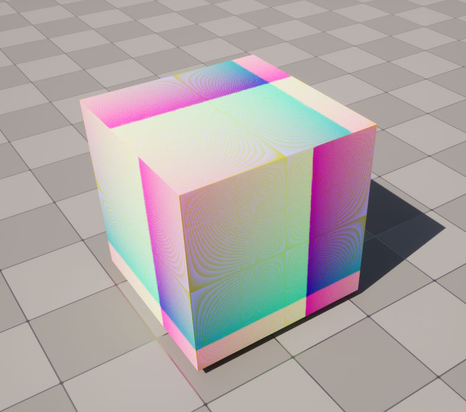
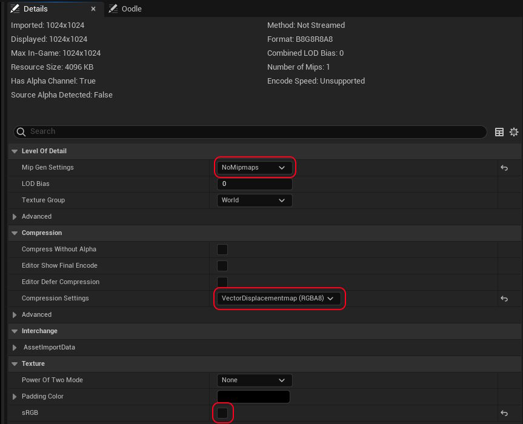
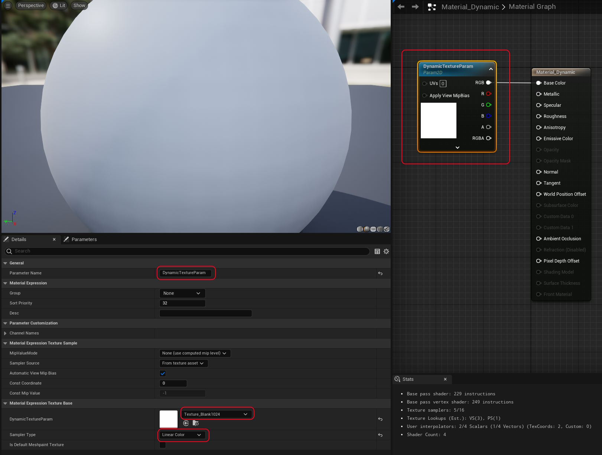
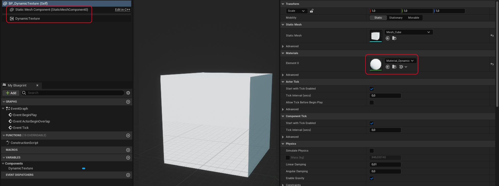

# DynamicTexture Sample for Unreal Engine 5

If you've ever wanted to generate a texture from C++ in UE5, here's one way to do it.

## Quickstart using the plugin

I've never packed up an Unreal plugin before, so maybe the plugin in the [`src`](./src) folder just works for you if you copy it into your project folder, :shrug:

1. Add the `BP_DynamicTexture` actor to your scene (it should be a cube with the `Material_Dynamic` already set on it, and `DynamicTexture` component already added)
2. Run the project and you should see a cube with a pattern like shown above
3. Modify the `UDynamicTextureComponent::TickComponent()` function to modify the texture in whatever way you want
4. Go back to Unreal, hit `CTRL-ALT-F11` to trigger a hot rebuild (do **NOT** use build from within Visual Studio)
5. Repeat from 3 until you have what you want

## How to replicate the plugin yourself

If the plugin fails for whatever reason, here's how I went about doing this.

### Create a new `UActorComponent`

- navigate to the `Tools` menu
- select `New C++ Class`
- click `Show all classes`
- type `ActorComponent`
- name it whatever you like, I called mine `DynamicTexture`

Unreal will do its thing, then should show you your files within Visual Studio

### Modify your build file to cater for our dependencies

- you should see a file ending with `.Build.cs` near your new source files (mine is `DynamicTexturePlugin.Build.cs`)
- you should see existing dependencies such as `"CoreUObject", "Engine", "Slate",  "SlateCore"`
- add `"RHI", "RenderCore"` to the end, otherwise you'll get linker error

### Implement the rest of the Owl

- copy the source from the repo into whatever files you've created
- [DynamicTextureComponent.cpp](src\DynamicTexturePlugin\Source\DynamicTexturePlugin\Private\DynamicTextureComponent.cpp)
- [DynamicTextureComponent.h](src\DynamicTexturePlugin\Source\DynamicTexturePlugin\Public\DynamicTextureComponent.cpp)

### Create a texture to use as a source

- pre-empting the next step, we need a blank texture
- create a texture the same size of what you're going to use via code, for me it's `1024x1024`
- save it as a PNG and import it into Unreal (I called mine `Texture_Blank1024`)
- double-click it to open it
- change `Mip Gen Settings` to `NoMipmaps`
- change `Compression Settings` to `VectorDisplacementMap (RGBA8)` (which ironically results in a `B8G8R8A8` texture for us to use)
- uncheck the `sRGB` checkbox

### Create a new material

- right click on your content browser and click `New Material`, I named mine `Material_Dynamic`
- double-click it to open it
- left click the `Base Color` pin and drag it off to the side, then release it
- in the popup that appears, type `TextureSampleParameter2D` to create that node
- it will be asking for the name of it, **make sure to name it** `DynamicTextureParam`
- with the node still selected, note the `Material Expression Texture Base` section of the `Details` tab that should be visible somewhere
- change the texture from `DefaultTexture` to the texture you setup in the previous step (`Texture_Blank1024` for me)
- change the `Sampler Type` to `LinearColor` (this would fail with the default texture, which is why we created our own first)

### Finally we can create our actor to use this all

- right click on your content browser and click `Blueprint Class`
- show all classed
- selected `StaticMeshActor`
- I named mine `BP_DynamicTexture`
- double-click it to open it
- select the `StaticMeshComponent` component and select a mesh, any will do, a plane works
- change the material it's using to be the material we created above (`Material_Dynamic` for me)
- now add a new component, the component we created in the first step (`DynamicTextureComponent` for me)

Now you should finally be able to run your project and see a changing texture!

